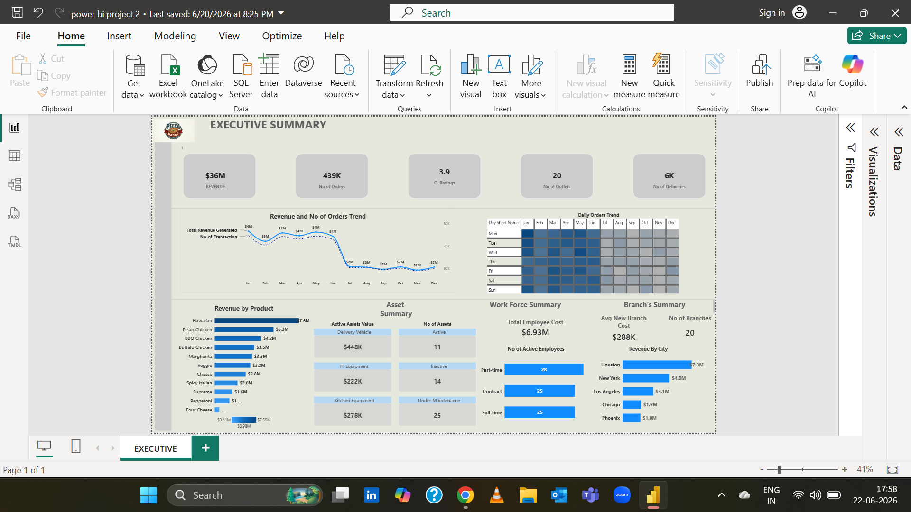
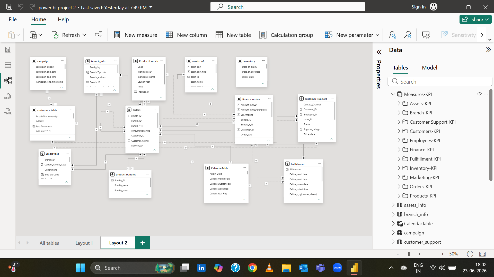

# Pizza Business Analytics | Power BI

## Project Overview

Business performance is influenced by more than sales alone. Revenue, customer activity, workforce utilization, marketing effectiveness, asset management, inventory operations, and branch performance all contribute to business outcomes. When these functions are analyzed independently, it becomes difficult to understand the factors driving performance across the organization.

This project consolidates data from multiple business functions into a centralized Power BI reporting solution for a multi-location pizza restaurant chain. The objective was to create a unified analytical environment that supports performance evaluation, trend analysis, and operational decision-making.

The analysis combines finance, customer, workforce, inventory, asset, fulfillment, and marketing data to provide a broader view of business performance rather than focusing on a single department or metric.

---

## Business Objectives

The project was designed to support the following business questions:

* How is revenue trending over time, and where are changes occurring?
* Which products contribute most to overall business performance?
* Which cities and branches generate the strongest results?
* Are operational resources being utilized effectively?
* Which business areas require additional investigation or management attention?
* What opportunities exist to improve performance across locations and functions?

---

## Analysis Areas

The reporting solution integrates multiple business functions, enabling performance analysis across:

### Finance & Revenue

* Revenue performance monitoring
* Revenue trend analysis
* Product revenue contribution

### Customer & Orders

* Order volume analysis
* Customer activity monitoring
* Service rating visibility

### Branch Performance

* City-level revenue analysis
* Branch comparison and evaluation
* Location performance monitoring

### Workforce Management

* Workforce composition analysis
* Employee distribution monitoring

### Asset & Operations Management

* Asset utilization tracking
* Maintenance activity monitoring
* Operational resource visibility

### Marketing & Growth

* Campaign performance evaluation
* Product launch monitoring
* Growth opportunity identification

---

## Data Model

The solution was built using a relational data model consisting of multiple fact and dimension tables covering:

* Finance
* Orders
* Customers
* Branches
* Employees
* Marketing Campaigns
* Inventory
* Assets
* Product Launches
* Customer Support
* Fulfillment Operations
* Calendar & Time Intelligence

The model enables cross-functional analysis by connecting operational and business data across the organization.

---

## Technical Implementation

### Tools & Technologies

* Power BI Desktop
* Power Query
* DAX
* Relational Data Modeling
* Data Visualization

### Development Approach

The project was developed using:

* Data transformation and preparation in Power Query
* Relational data modeling
* Custom DAX measures for KPI tracking and performance analysis
* Interactive reporting for business exploration and decision support

The model includes multiple interconnected business domains and a collection of analytical measures designed to support operational and strategic reporting requirements.

---

## Key Findings

### 1. Revenue Declines During the Second Half of the Year

#### Observation

Revenue remains relatively stable during the first half of the year before declining noticeably during later months.

#### What It May Indicate

The decline may be influenced by changing customer demand, seasonal factors, branch performance issues, product mix shifts, operational constraints, or campaign effectiveness.

#### Recommended Investigation

* Compare customer activity across periods.
* Analyze branch-level performance trends.
* Evaluate campaign effectiveness before and after the decline.
* Review product-level contribution during affected periods.

---

### 2. Revenue Contribution Varies Significantly Across Cities

#### Observation

Revenue generation is not evenly distributed across locations. Phoenix contributes substantially less revenue than higher-performing cities.

#### What It May Indicate

Lower revenue may be associated with differences in market demand, operational execution, customer behavior, competitive conditions, or marketing effectiveness.

#### Recommended Investigation

* Compare campaign performance across cities.
* Analyze order volume and customer activity by location.
* Evaluate branch-level operational performance.
* Identify factors contributing to stronger results in leading markets.

---

### 3. Revenue Is Concentrated Among a Limited Number of Products

#### Observation

Certain products contribute significantly more revenue than others, while some products generate comparatively lower revenue.

#### What It May Indicate

Lower revenue contribution does not necessarily indicate weak product performance. Product age, launch timing, order frequency, customer preferences, and pricing strategies may all influence revenue contribution.

#### Recommended Investigation

* Analyze product order frequency.
* Evaluate average revenue per order.
* Review performance of recently launched products.
* Identify opportunities to expand revenue from high-demand products.

---

### 4. Asset Maintenance Levels Appear Relatively High

#### Observation

A significant portion of tracked assets are classified as under maintenance rather than active.

#### What It May Indicate

This may indicate maintenance inefficiencies, aging equipment, recurring asset issues, replacement requirements, or operational constraints affecting utilization.

#### Recommended Investigation

* Analyze maintenance frequency and duration.
* Identify recurring maintenance patterns.
* Compare maintenance activity across asset categories.
* Evaluate repair-versus-replacement decisions.

---

### 5. Business Performance Appears Concentrated in Specific Revenue Drivers

#### Observation

Both product and location performance show uneven contribution patterns.

#### What It May Indicate

Business performance may depend heavily on a relatively small number of products or locations, potentially increasing operational and revenue concentration risk.

#### Recommended Investigation

* Identify characteristics of high-performing products and locations.
* Evaluate opportunities to replicate successful practices.
* Investigate barriers limiting growth in lower-performing segments.

---

## Recommendations

Based on the current analysis, the following areas warrant further investigation:

1. Identify the primary drivers behind the revenue decline observed during the second half of the year.
2. Conduct branch and city-level reviews for lower-performing locations.
3. Evaluate campaign effectiveness and marketing return across regions.
4. Analyze product performance beyond revenue contribution alone.
5. Improve visibility into asset utilization and maintenance efficiency.
6. Investigate revenue concentration risks across products and locations.
7. Develop deeper customer and operational performance analysis to support future decision-making.

---

## Future Analysis Opportunities

The current solution provides a foundation for additional business analysis, including:

* Customer Lifetime Value (CLV)
* Customer Segmentation
* Campaign ROI Analysis
* Branch Profitability Analysis
* Product Lifecycle Analysis
* Inventory Optimization
* Workforce Productivity Analysis
* Customer Support Performance Analysis
* Delivery Performance Analysis
* Revenue Forecasting & Demand Planning

---

## Dashboard Preview

### Executive Dashboard

### Data Model

![Data Model](assets/data-model.png

### Measures Overview

### Tables Overview

![Tables Overview](assets/tables-overview.png

---

## Business Value

This project combines data from multiple business functions into a unified reporting environment, enabling a broader understanding of business performance across revenue, operations, customers, workforce, assets, and marketing activities.

Rather than focusing solely on reporting metrics, the analysis highlights areas requiring further investigation, supports performance evaluation, and provides a foundation for data-informed business decision-making.
